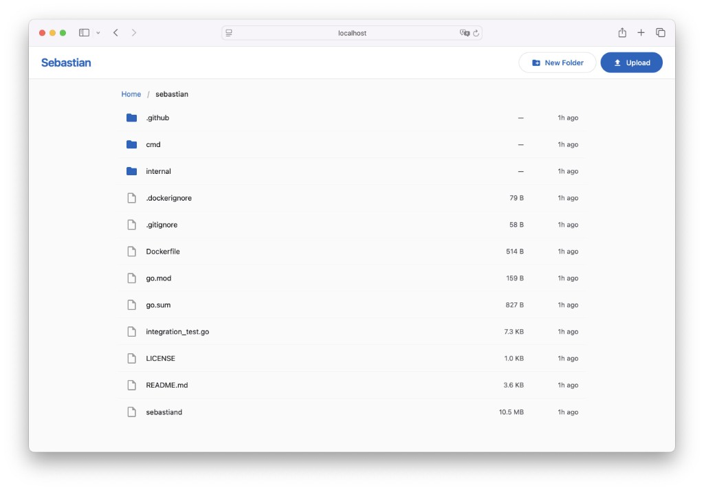

# Sebastian

A simple, reliable single-node file server that projects S3, WebDAV, SFTP, and HTTP UI protocols onto a local directory. Think of it as a protocol gateway for your filesystem.



## Features

- **S3-compatible API** — path-style and virtual-hosted-style addressing, ListBuckets, GetObject, PutObject, DeleteObject, ListObjectsV1/V2
- **WebDAV** — full PROPFIND/GET/PUT/DELETE/MKCOL/MOVE/COPY/LOCK/UNLOCK support, compatible with macOS Finder, Windows Explorer, Cyberduck, rclone
- **SFTP** — SSH File Transfer Protocol v3, compatible with OpenSSH sftp, FileZilla, WinSCP
- **HTTP UI** — Material 3 styled web file browser with upload, download, rename, delete, drag-and-drop folder upload
- **Atomic writes** — all file writes use temp file + rename for consistency
- **Path traversal protection** — two-layer defense (textual check + absolute path verification)

## Quick Start

### Docker

```bash
docker run -d \
  -p 9200:9200 -p 9300:9300 -p 9400:9400 -p 9500:9500 \
  -v /path/to/files:/data/files \
  -e SEBASTIAN_S3_ENABLED=true \
  -e SEBASTIAN_HTTP_ENABLED=true \
  solkin/sebastian
```

Open http://localhost:9400 for the web UI. Use any S3 client against http://localhost:9200.

### Binary

```bash
go install github.com/solkin/sebastian/cmd/sebastiand@latest
sebastiand -config config.yaml
```

## Configuration

Sebastian can be configured via a YAML file, environment variables, or both. Environment variables take precedence.

### YAML

```yaml
root_dir: /data/files

gateways:
  s3:
    enabled: true
    listen_addr: ":9200"
    access_key: ""
    secret_key: ""
    domain: ""
  webdav:
    enabled: false
    listen_addr: ":9300"
    username: ""
    password: ""
  http:
    enabled: true
    listen_addr: ":9400"
    username: ""
    password: ""
  sftp:
    enabled: false
    listen_addr: ":9500"
    username: ""              # client auth (empty = anonymous)
    password: ""              # client auth
    host_key_path: "/etc/sebastian/sftp_host_key"  # server identity key (required)
```

### Environment Variables

| Variable | Description | Default |
|---|---|---|
| `SEBASTIAN_ROOT_DIR` | Root directory to serve | `/data/files` |
| `SEBASTIAN_S3_ENABLED` | Enable S3 gateway | `false` |
| `SEBASTIAN_S3_LISTEN_ADDR` | S3 listen address | `:9200` |
| `SEBASTIAN_S3_ACCESS_KEY` | S3 access key (empty = no auth) | |
| `SEBASTIAN_S3_SECRET_KEY` | S3 secret key | |
| `SEBASTIAN_S3_DOMAIN` | Base domain for virtual-hosted-style S3 (empty = path-style only) | |
| `SEBASTIAN_WEBDAV_ENABLED` | Enable WebDAV gateway | `false` |
| `SEBASTIAN_WEBDAV_LISTEN_ADDR` | WebDAV listen address | `:9300` |
| `SEBASTIAN_WEBDAV_USERNAME` | WebDAV username (empty = no auth) | |
| `SEBASTIAN_WEBDAV_PASSWORD` | WebDAV password | |
| `SEBASTIAN_HTTP_ENABLED` | Enable HTTP UI gateway | `false` |
| `SEBASTIAN_HTTP_LISTEN_ADDR` | HTTP UI listen address | `:9400` |
| `SEBASTIAN_HTTP_USERNAME` | HTTP UI username (empty = no auth) | |
| `SEBASTIAN_HTTP_PASSWORD` | HTTP UI password | |
| `SEBASTIAN_SFTP_ENABLED` | Enable SFTP gateway | `false` |
| `SEBASTIAN_SFTP_LISTEN_ADDR` | SFTP listen address | `:9500` |
| `SEBASTIAN_SFTP_USERNAME` | SFTP username for client auth (empty = anonymous access) | |
| `SEBASTIAN_SFTP_PASSWORD` | SFTP password for client auth | |
| `SEBASTIAN_SFTP_HOST_KEY_PATH` | Path to server identity key file (required, auto-generated on first run) | |

At least one gateway must be enabled. When SFTP is enabled, `host_key_path` must be explicitly set.

### SFTP Notes

SFTP runs over SSH, which requires two separate mechanisms:

- **Server identity key** (`host_key_path`) — the server's cryptographic identity, similar to a TLS certificate. SSH clients verify this key to ensure they are connecting to the correct server. The key file is auto-generated on first startup if it does not exist at the specified path. Keep the same file across restarts to avoid "host key changed" warnings in clients.
- **Client authentication** (`username` / `password`) — credentials that clients must provide to connect. If both are empty, any client can connect without authentication.

#### Connecting

```bash
# With authentication:
sftp -P 9500 user@localhost

# Without authentication (if username/password are empty):
sftp -P 9500 -o User=anonymous localhost
```

On first connection, the client will ask to trust the server's host key — this is normal SSH behavior.

## S3 Bucket Mapping

S3 buckets map to first-level subdirectories of `root_dir`:

```
root_dir/
  photos/        ← bucket "photos"
    img.jpg      ← object "img.jpg"
    2024/
      jan.jpg    ← object "2024/jan.jpg"
  documents/     ← bucket "documents"
```

## Building

```bash
go build -o sebastiand ./cmd/sebastiand
```

## Testing

```bash
go test -race ./...
```

## License

MIT
