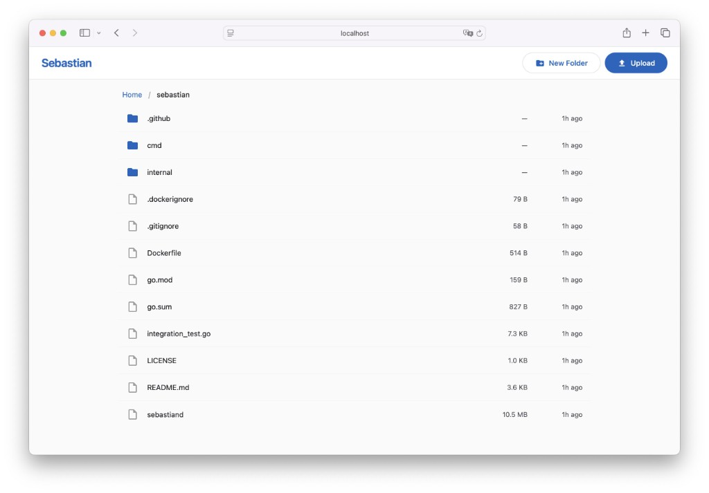

# Sebastian

A simple, reliable single-node file server that projects S3, WebDAV, SFTP, and HTTP UI protocols onto a local directory. Think of it as a protocol gateway for your filesystem.



## Features

- **S3-compatible API** — path-style and virtual-hosted-style addressing, ListBuckets, GetObject, PutObject, DeleteObject, ListObjectsV1/V2
- **S3 multipart uploads** — CreateMultipartUpload, UploadPart, CompleteMultipartUpload, AbortMultipartUpload, ListParts, ListMultipartUploads; crash-safe staging, TTL cleanup, and per-part checksums
- **WebDAV** — full PROPFIND/GET/PUT/DELETE/MKCOL/MOVE/COPY/LOCK/UNLOCK support, compatible with macOS Finder, Windows Explorer, Cyberduck, rclone
- **SFTP** — SSH File Transfer Protocol v3, compatible with OpenSSH sftp, FileZilla, WinSCP
- **HTTP UI** — Material 3 styled web file browser with upload, download, rename, delete, drag-and-drop folder upload
- **Atomic writes** — all file writes use temp file + rename for consistency
- **Path traversal protection** — three-layer defense (textual check + absolute path verification + symlink-escape resolution), applied uniformly across all gateways

## Quick Start

### Docker

```bash
docker run -d \
  -p 9200:9200 -p 9300:9300 -p 9400:9400 -p 9500:9500 \
  -v /path/to/files:/data/files \
  -e SEBASTIAN_S3_ENABLED=true \
  -e SEBASTIAN_HTTP_ENABLED=true \
  solkin/sebastian
```

Open http://localhost:9400 for the web UI. Use any S3 client against http://localhost:9200.

### Binary

```bash
go install github.com/solkin/sebastian/cmd/sebastiand@latest
sebastiand -config config.yaml
```

## Configuration

Sebastian can be configured via a YAML file, environment variables, or both. Environment variables take precedence.

### YAML

```yaml
root_dir: /data/files
max_upload_bytes: 0           # cap a single upload (bytes); 0 = unlimited for S3/WebDAV, 1 GiB default for HTTP UI

multipart:                    # S3 multipart upload limits and retention
  min_part_bytes: 5242880     # 5 MiB — minimum size of every part but the last
  max_part_bytes: 5368709120  # 5 GiB — maximum size of a single part
  max_parts: 10000            # highest accepted part number
  max_active_uploads: 10000   # simultaneously staged uploads; 0 = unlimited
  max_concurrent_part_uploads: 0  # in-flight part uploads; 0 = unlimited
  upload_ttl: 168h            # discard an untouched incomplete upload after this
  cleanup_interval: 1h        # how often the janitor sweeps
  temp_file_max_age: 24h      # age at which an orphaned scratch file is removed

gateways:
  s3:
    enabled: true
    listen_addr: ":9200"
    access_key: ""
    secret_key: ""
    domain: ""
  webdav:
    enabled: false
    listen_addr: ":9300"
    username: ""
    password: ""
  http:
    enabled: true
    listen_addr: ":9400"
    username: ""
    password: ""
  sftp:
    enabled: false
    listen_addr: ":9500"
    username: ""              # client auth (empty = anonymous)
    password: ""              # client auth
    host_key_path: "/etc/sebastian/sftp_host_key"  # server identity key (required)
```

### Environment Variables

| Variable | Description | Default |
|---|---|---|
| `SEBASTIAN_ROOT_DIR` | Root directory to serve | `/data/files` |
| `SEBASTIAN_MAX_UPLOAD_BYTES` | Max size of a single upload in bytes (`0` = unlimited for S3/WebDAV; HTTP UI defaults to 1 GiB) | `0` |
| `SEBASTIAN_MULTIPART_MIN_PART_BYTES` | Minimum size of every multipart part but the last | `5242880` (5 MiB) |
| `SEBASTIAN_MULTIPART_MAX_PART_BYTES` | Maximum size of a single multipart part | `5368709120` (5 GiB) |
| `SEBASTIAN_MULTIPART_MAX_PARTS` | Highest accepted part number | `10000` |
| `SEBASTIAN_MULTIPART_MAX_ACTIVE_UPLOADS` | Simultaneously staged uploads (`0` = unlimited) | `10000` |
| `SEBASTIAN_MULTIPART_MAX_CONCURRENT_PART_UPLOADS` | In-flight part uploads (`0` = unlimited); over the cap returns `SlowDown` | `0` |
| `SEBASTIAN_MULTIPART_UPLOAD_TTL` | Retention for untouched incomplete uploads (duration, e.g. `168h`) | `168h` |
| `SEBASTIAN_MULTIPART_CLEANUP_INTERVAL` | How often the janitor sweeps (duration) | `1h` |
| `SEBASTIAN_MULTIPART_TEMP_FILE_MAX_AGE` | Age at which an orphaned scratch file is removed (duration) | `24h` |
| `SEBASTIAN_S3_ENABLED` | Enable S3 gateway | `false` |
| `SEBASTIAN_S3_LISTEN_ADDR` | S3 listen address | `:9200` |
| `SEBASTIAN_S3_ACCESS_KEY` | S3 access key (empty = no auth) | |
| `SEBASTIAN_S3_SECRET_KEY` | S3 secret key | |
| `SEBASTIAN_S3_DOMAIN` | Base domain for virtual-hosted-style S3 (empty = path-style only) | |
| `SEBASTIAN_WEBDAV_ENABLED` | Enable WebDAV gateway | `false` |
| `SEBASTIAN_WEBDAV_LISTEN_ADDR` | WebDAV listen address | `:9300` |
| `SEBASTIAN_WEBDAV_USERNAME` | WebDAV username (empty = no auth) | |
| `SEBASTIAN_WEBDAV_PASSWORD` | WebDAV password | |
| `SEBASTIAN_HTTP_ENABLED` | Enable HTTP UI gateway | `false` |
| `SEBASTIAN_HTTP_LISTEN_ADDR` | HTTP UI listen address | `:9400` |
| `SEBASTIAN_HTTP_USERNAME` | HTTP UI username (empty = no auth) | |
| `SEBASTIAN_HTTP_PASSWORD` | HTTP UI password | |
| `SEBASTIAN_SFTP_ENABLED` | Enable SFTP gateway | `false` |
| `SEBASTIAN_SFTP_LISTEN_ADDR` | SFTP listen address | `:9500` |
| `SEBASTIAN_SFTP_USERNAME` | SFTP username for client auth (empty = anonymous access) | |
| `SEBASTIAN_SFTP_PASSWORD` | SFTP password for client auth | |
| `SEBASTIAN_SFTP_HOST_KEY_PATH` | Path to server identity key file (required, auto-generated on first run) | |

At least one gateway must be enabled. When SFTP is enabled, `host_key_path` must be explicitly set.

### SFTP Notes

SFTP runs over SSH, which requires two separate mechanisms:

- **Server identity key** (`host_key_path`) — the server's cryptographic identity, similar to a TLS certificate. SSH clients verify this key to ensure they are connecting to the correct server. The key file is auto-generated on first startup if it does not exist at the specified path (a warning is logged when this happens). Keep the same file across restarts to avoid "host key changed" warnings in clients — in Docker, mount a volume covering the key path (the image stores it at `/data/sftp_host_key` and declares `/data` as a volume, so a named volume like `-v sebastian-data:/data` persists it across container recreation).
- **Client authentication** (`username` / `password`) — credentials that clients must provide to connect. If both are empty, any client can connect without authentication.

#### Connecting

```bash
# With authentication:
sftp -P 9500 user@localhost

# Without authentication (if username/password are empty):
sftp -P 9500 -o User=anonymous localhost
```

On first connection, the client will ask to trust the server's host key — this is normal SSH behavior.

## S3 Bucket Mapping

S3 buckets map to first-level subdirectories of `root_dir`:

```
root_dir/
  photos/        ← bucket "photos"
    img.jpg      ← object "img.jpg"
    2024/
      jan.jpg    ← object "2024/jan.jpg"
  documents/     ← bucket "documents"
```

`root_dir/.sebastian/` is reserved for sebastian's own state (multipart staging).
It is not a bucket, is hidden from every gateway's listings, and cannot be read or
written through any protocol.

## S3 Multipart Uploads

The full multipart API is supported, so `aws s3 cp` of a large file, `aws s3api`,
boto3, rclone, and the S3 SDKs upload in parallel chunks out of the box:

| Operation | Request |
|---|---|
| CreateMultipartUpload | `POST /{bucket}/{key}?uploads` |
| UploadPart | `PUT /{bucket}/{key}?partNumber={n}&uploadId={id}` |
| CompleteMultipartUpload | `POST /{bucket}/{key}?uploadId={id}` |
| AbortMultipartUpload | `DELETE /{bucket}/{key}?uploadId={id}` |
| ListParts | `GET /{bucket}/{key}?uploadId={id}` |
| ListMultipartUploads | `GET /{bucket}?uploads` |

### Durability and integrity

- Parts are staged under `root_dir/.sebastian/multipart/{uploadId}/`, never inside
  a bucket, so an incomplete upload is invisible to every protocol and its parts
  never show up as objects.
- Each part is streamed to a scratch file, hashed, and published with a single
  atomic rename. An interrupted transfer leaves nothing staged, and re-sending a
  part number simply replaces it — retrying a failed part is always safe.
- `Content-MD5` on `UploadPart` is enforced when present, as is a concrete
  `x-amz-content-sha256` (the digest the request's signature covers), so a
  captured signed request cannot be replayed with a swapped part body. The
  response `ETag` is the part's MD5.
- Completion validates the client's part list the way S3 does: parts must be
  strictly ascending, every `ETag` must match what was staged, and every part but
  the last must reach `min_part_bytes` (`InvalidPartOrder`, `InvalidPart`,
  `EntityTooSmall`).
- Assembly re-hashes every part as it is copied and checks the finished file's
  size before publishing it, so a part corrupted on disk fails the completion
  instead of producing a bad object. The object appears under its key with a
  single atomic rename, in the same directory, so it works even when a bucket is
  a separate mount.
- Atomic-write scratch files (`.seb-tmp-*`, `.seb-bak-*`) are a reserved
  namespace: they are never reported as objects by `ListObjects`, and no gateway
  will create a file with one of those prefixes — such a name is refused up front
  rather than accepted and then swept away as an orphan.
- All upload state lives on disk, so a restart mid-upload loses nothing: the new
  process can accept further parts for, complete, or abort an upload its
  predecessor started.

### Retention

A background janitor removes uploads left untouched for `upload_ttl` (the
equivalent of an `AbortIncompleteMultipartUpload` lifecycle rule) and orphaned
atomic-write scratch files older than `temp_file_max_age`. An upload's age is
measured from its most recent activity, so a slow transfer that keeps sending
parts is never collected out from under the client. A bucket with in-progress
uploads cannot be deleted (`BucketNotEmpty`).

### ETag semantics

`CompleteMultipartUpload` returns the standard composite ETag — the MD5 of the
concatenated part digests, suffixed with `-{partCount}`. A later `GET`/`HEAD`/
`LIST` of that object returns sebastian's usual ETag, which is derived from size
and modification time rather than content (the same as for objects written with a
plain `PUT`). Clients that compare a stored multipart ETag against a later `HEAD`
will see a difference; nothing in the AWS SDKs' upload or download paths depends
on it.

## S3 Authentication

When `access_key`/`secret_key` are set, requests must be signed with AWS Signature
Version 4 — either via the `Authorization` header or presigned query parameters.
Any S3 SDK or tool configured with the same credentials works out of the box.

- Legacy Signature V2 (`AWS key:signature`) is not supported.
- Presigned URLs are validated against their `X-Amz-Expires` window.
- When a client sends a concrete `x-amz-content-sha256` digest, uploads are
  re-hashed and rejected on mismatch, so a captured signed request cannot be
  replayed with a swapped body. `UNSIGNED-PAYLOAD` and `aws-chunked` streaming
  bodies carry no verifiable digest and are not integrity-checked; run behind TLS
  for transport security.

Leaving both keys empty disables authentication (all requests are allowed).

## Deployment

Sebastian serves plain HTTP (SFTP runs over SSH); it does not terminate TLS
itself. Run it behind a reverse proxy (nginx, Caddy, Traefik, …) that terminates
TLS for the S3, WebDAV, and HTTP UI ports. Configure the proxy to forward the
original `Host` header — the HTTP UI's CSRF protection compares the request
`Origin`/`Referer` host against it.

The container image runs as a non-root user; bind-mounted data directories must
be writable by that user.

## Building

```bash
go build -o sebastiand ./cmd/sebastiand
```

## Testing

```bash
go test -race ./...
```

## License

MIT
